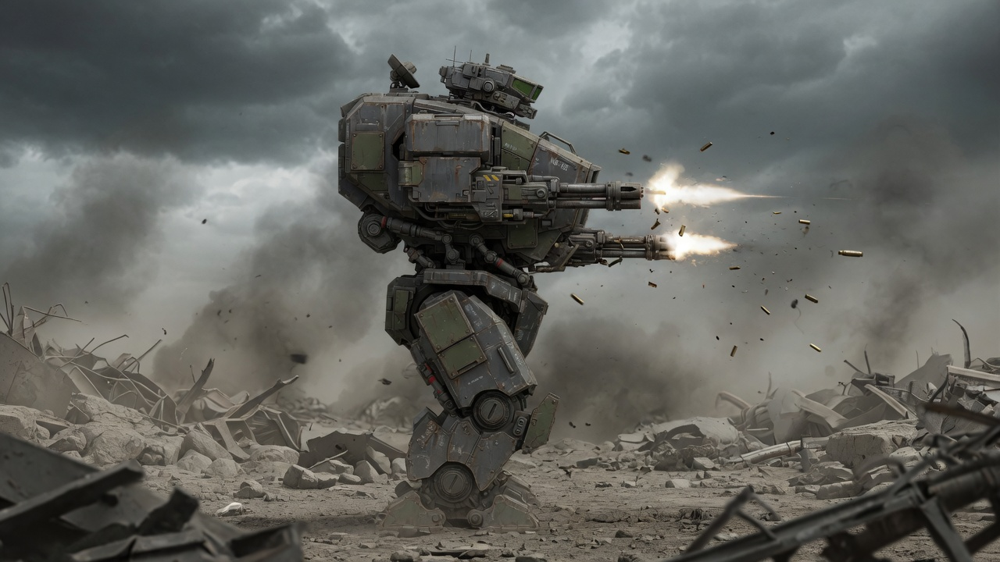

# walker2



A slow, physically-simulated bipedal mech with a fast, freely-aimed gun, fighting an omnidirectional swarm on terrain that deforms and collapses under fire. Godot 4, GDScript, 2D. Control scheme inspired by Walker (DMA Design, 1993): the body is a lumbering liability, the aim is fast and free, and staying upright is half the fight.

**Status: M4 (first enemy loop) complete.** The mech's look comes straight from the approved walk footage: the walk harvest plays as a legs animation (masked below the waist, torso-stabilized), and a torso+cannons plate cut from the same frames pivots instantly at the waist toward the mouse — including rear aim, Walker-style. One rigid body carries weight, momentum, recoil, and the downward-fire jump boost. Walking and aiming are separate layers, so you can do both at once with no ghosting. The M1 motorized-ragdoll walker (`scripts/walker.gd`) is retired from the main scene but kept in the repo.

The frame pipeline is `tools/build_player_frames.py`: it stabilizes the source frames on the torso (the source video pans), splits them at the waist with a feathered seam, de-fringes the chroma key, and exports a per-frame bob table so the torso overlay rides the legs exactly.

## Run

Requires Godot 4.x (built and tested on 4.7.1). Open the project folder in Godot and press Play, or from the command line:

```sh
godot --path .          # or: /Applications/Godot.app/Contents/MacOS/Godot --path .
```

### Controls

| Input | Action |
|---|---|
| A / D (or ←/→) | walk left / right |
| Mouse | aim (free, including behind you) |
| Left mouse button | rapid fire — recoil is real; firing at the ground boosts you up |
| (land hard) | stomp: boost up and drop onto enemies — cracks the ground, kills the swarm nearby |
| Q / E | debug push (test balance recovery) |
| R | reset |

### Headless selftest

```sh
godot --headless -- selftest
```

Runs the M1–M4 gate automatically: stand, walk, push recovery, rapid fire under recoil, downfire boost, landing stomp, terrain carving, and killing a runner. Prints PASS/FAIL per check (16 checks) and exits nonzero on failure.

## Terrain (M3) and enemies (M4)

The arena (±2048 px around spawn) is a **material grid**: 8 px cells of dirt over rock (`scripts/terrain.gd`). Every tracer, runner detonation, burrower bite, and stomp carves it — dirt clears easily, rock resists (`rock_hardness`). Collision is an invisible TileMapLayer that erases cells as they're carved; visuals are chunked images blitted from the tiling material textures; debris chunks are code-drawn rigid bodies. Beyond the arena, indestructible bedrock. `surface_y(x)` exposes the ground line to AI.

Three enemies (`scripts/runner|paratrooper|burrower.gd`, spawner in `main.gd`, escalating intervals):

- **Runner** — charges along the ground, hops crater rims, detonates on contact (crater + knockback). Two hits.
- **Paratrooper** — drifts down under a chute (one shot), then walks in and chews with melee.
- **Burrower** — tunnels toward you *eating the terrain under your feet*; unshootable underground, then erupts in a blast crater and surfaces as a runner.

The stomp closes the loop with the boost: fire down to hover, drop onto the swarm — the landing kills everything nearby and cracks the ground. Player has HP; death is R-to-restart.

## Legacy: how the M1 physics-walker balance works

Per the design pillars, fun beats floaty realism. The controller layers, from most to least physical:

1. **Joint PD motors** — knees are torque motors between adjacent bodies (torque + equal/opposite reaction). Upper legs track world-frame gait targets (anchoring them to the hip body let reaction torques twist the gait's own reference frame — found the hard way).
2. **Upright stabilizer springs** — world-anchored PD torques hold the torso and hip near vertical. This is the "stabilized upright spring" fallback from the design brief: recoil, pushes, and terrain still shove the body around, but it always fights back to vertical.
3. **Ride-height suspension** — a vertical spring on the hip/torso, active only while a foot has ground contact, capped near the mech's weight so it can never hover or hop. Keeps stance legs from buckling under dynamic load.
4. **Ground drive** — a horizontal force toward target speed, gated by foot contact (with 0.2 s coyote time). The gait provides the stepping; the drive guarantees responsiveness.

Physics runs at 240 Hz (`project.godot`) — motorized ragdolls explode at 60 Hz with gains this stiff.

## How aim works (M2)

Aim is instant and non-physical, per the design pillars ("dumb slow body, smart fast aim"): the visual upper assembly — torso art + gun — pivots at the waist toward the cursor, clamped to −70°…+55°, and flips horizontally for rear aim. The physics torso underneath never rotates to aim; it just keeps balancing. What IS physical is the consequence: every shot applies a real impulse opposite the barrel (`recoil_impulse`), so sustained fire shoves you around, and firing downward multiplies the recoil (`downfire_boost`) into a jump assist strong enough to climb. Projectiles are ray-stepped tracers; muzzle flash and impact FX are pure code (no art files), per the FX rule.

## Tunables

All exported at the top of `scripts/walker.gd` (masses, PD gains, gait, drive, suspension, push strength) and `scripts/main.gd` (ground, camera). Suggested tuning starting points for M1 review:

- `walk_speed`, `stride_hz`, `hip_swing_amp` — stride feel. Currently ~172 px/s.
- `gravity_scale_all`, `torso_kp/kd` — weight vs. stiffness of the body.
- `suspension_*` — stance firmness. Cap it near weight (`5.5e4`–`7e4`); higher makes it hop.
- `knee_lift` — swing-foot ground clearance. Too low and the feet scuff and the walk stalls.
- `fire_rate`, `recoil_impulse` — how hard sustained fire pushes you around.
- `downfire_boost` — jump-assist strength. Note the 55° down-pitch clamp: only ~0.82 of the boosted impulse is vertical, so it must comfortably beat weight (≈3.8e4 impulse/s) to lift.
- `aim_up_max_deg` / `aim_down_max_deg` — the waist pitch arc.

## Assets

`ASSETS.md` is the manifest contract shared with the art pipeline. The game loads every asset by fixed path; anything missing falls back to a generated placeholder (`scripts/asset_loader.gd`), so dropping art in (or deleting it) never breaks the game. `tools/gen_placeholders.py` (Python + PIL) regenerates labeled placeholders for all manifest entries.

Notes for the art pipeline from first integration:

- Part art should fill its canvas to the stated pivot edges — internal padding reads as gaps at the joints (visible at knees/ankles with the current drop).
- `bg/parallax_*.png` tile horizontally with mirroring every 1920 px — art must be full-bleed edge-to-edge horizontally or the seam shows sky through the gap.

## Milestones

- [x] **M1 Walk and balance** — stands, walks A/D with weight and momentum, recovers from debug pushes. Verified by headless selftest.
- [x] **M2 Aim and fire** — waist-pitch cursor aim (incl. rear), rapid-fire tracers, physical recoil, downward-fire boost. Verified by headless selftest.
- [x] **M3 Deformable ground** — material grid (dirt/rock), craters from every weapon, debris. Verified by headless selftest.
- [x] **M4 First enemy loop** — runner, paratrooper, burrower, landing stomp, HP/kills/death. Verified by headless selftest.
- [ ] M5 The hook — one encounter only physics + deformation makes possible.
